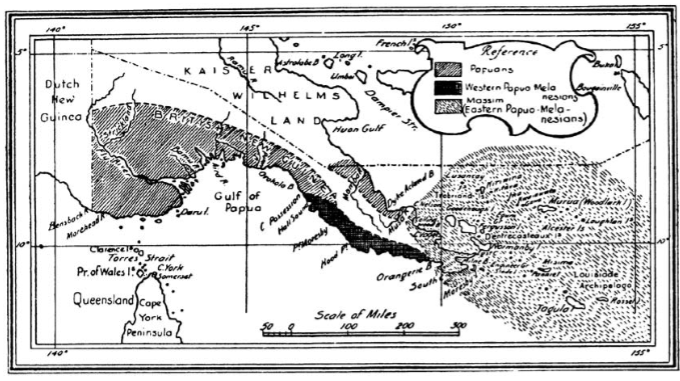

autoscale: true

# Reading and Doing Ethnography

### Social Anthropology 314

---

# 1.1 What is ethnography?

---

> Ethnos ("people") + graphy ("writing")
-- etymology

---

# Bronislaw Malinowski
## Ethnography's primal scene

---

# Argonauts of the Western Pacific

A study of local economies in the Trobriand Islands.

---

---

# Malinowski's *image* of fieldwork

---

> Imagine yourself suddenly set down surrounded by all your gear, alone on a tropical beach close to a native village, while the launch or dinghy which has brought you sails away out of sight. Since you take up your abode in the compound of some neighbouring white man, trader or missionary, you have nothing to do, but to start at once on your ethnographic work. Imagine further that you are a beginner, without previous experience, with nothing to guide you and no one to help you.

---

> I well remember the long visits I paid to the villages during the first weeks; the feeling of hopelessness and despair after many obstinate but futile attempts had entirely failed to bring me into real touch with the natives, or supply me with any material.

---

> I had periods of despondency, when I buried myself in the reading of novels, as a man might take to drink in a fit of tropical depression and boredom.

---

> Imagine yourself then, making your first entry into the village, alone or in company with your white cicerone. Some natives flock round you, especially if they smell tobacco. Others, the more dignified and elderly, remain seated where they are.

---

> Your white companion has his routine way of treating the natives, and he neither understands, nor is very much concerned with the manner in which you, as an ethnographer, will have to approach them. The first visit leaves you with a hopeful feeling that when you return alone, things will be easier. (3-4)

---

# The Malinowskian scenario

---

# The Malinowskian scenario

- You're immersed and alone.
- Depression and avoidance are common (and OK).
- Your fieldsite is remote and cut off from the world.
- You're white, but you're not like "other whites."
- You have to figure out how to approach the locals.
- You're fast immersed in local hierarchies and economies.

---

# The Other Whites

- Surprisingly ignorant of those around them.
- "Full of the biassed and pre-judged opinions inevitable in the average practical man."
- Typically colonial administrators, missionaries, or merchants.
- "You will naturally hanker after the company of your own kind."
- Divided into Western European vs "Slavonic" (outgoing) personalities.

In short: a critique of white ignorance, *and* a claim to white scientific potential.

---

# What makes good data?

---

> Only such ethnographic sources are of unquestionable scientific value, in which we can clearly draw the line between, on the one hand, the results of direct observation and of native statements and interpretations, and on the other, the inferences of the author, based on his common sense and psychological insight. (3)

---

# Things to notice here

- We can distinguish clearly between data and analysis.
- Anthropology is a Science.
- Authors are expected to be men.

---

## You can't just *read* ethnography.
## You have to practice it.

---

# Further Malinowskian considerations

---

# Participant Observation

> It is good for the Ethnographer sometimes to put aside camera, note book and pencil, and to join in himself in what is going on. He can take part in the natives’ games, he can follow them on their visits and walks, sit down and listen and share in their conversations. I am not certain if this is equally easy for everyone—perhaps the Slavonic nature is more plastic and more naturally savage than that of Western Europeans—but though the degree of success varies, the attempt is possible for everyone. (16)

---

# The value of theory

> Good training in theory, and acquaintance with its latest results, is not identical with being burdened with “preconceived ideas.” If a man sets out on an expedition, determined to prove certain hypotheses, if he is incapable of changing his views constantly and casting them off ungrudgingly under the pressure of evidence, needless to say his work will be worthless. But the more problems he brings with him into the field, the more he is in the habit of moulding his theories according to facts, and of seeing facts in their bearing upon theory, the better he is equipped for the work. (7)

---

# Holism

> The field Ethnographer has seriously and soberly to cover the full extent of the phenomena in each aspect of tribal culture studied, making no difference between what is commonplace, or drab, or ordinary, and what strikes him as astonishing and out-of-the-way. At the same time, the whole area of tribal culture in all its aspects has to be gone over in research. The consistency, the law and order which obtain within each aspect make also for joining them into one coherent whole. (8-9)

---

# The NPOV

> This goal is, briefly, to grasp the native’s point of view, his relation to life, to realise his vision of his world. We have to study man, and we must study what concerns him most intimately, that is, the hold which life has on him. In each culture, the values are slightly different; people aspire after different aims, follow different impulses, yearn after a different form of happiness. In each culture, we find different institutions in which man pursues his life-interest, different customs by which he satisfies his aspirations, different codes of law and morality which reward his virtues or punish his defections. (19)

---

# Abstractions

> Though we cannot ask a native about abstract, general rules, we can always enquire how a given case would be treated. Thus for instance, in asking how they would treat crime, or punish it, it would be vain to put to a native a sweeping question such as, “How do you treat and punish a criminal?” for even words could not be found to express it in native, or in pidgin. But an imaginary case, or still better, a real occurrence, will stimulate a native to express his opinion and to supply plentiful information. A real case indeed will start the natives on a wave of discussion, evoke expressions of indignation, show them taking sides—all of which talk will probably contain a wealth of definite views, of moral censures, as well as reveal the social mechanism set in motion by the crime committed. (9-10)

---

# Three kinds of data

1. The "organisation of the tribe, and the anatomy of its culture"
2. The "imponderabilia of actual life"
3. The "documents of native mentality"

---

# Three kinds of data

Malinowski is right that it's best to collect a range of kinds of data. But the actual typology is very problematic. 

Linguistic documents don't directly reveal anything about "native mentality," for example.

---

# Guidelines

---

# The self is an instrument

Every science involves instruments, but one of the peculiarities of ethnography is that the researcher her- or himself becomes the instrument of data collection. Ethnographic observation therefore cannot be entirely routinized, since it is always shaped by your own processes of perception, which in turn emerge from your own biography and social origins. This does not mean that every observation is “subjective” or arbitrary; on the contrary, ethnography shows us that experience and subjectivity are themselves products of society and history.

---

# Cultural worlds are vast, and they exceed us

It is worth reminding ourselves that, although ethnographic investigation can produce vast quantities of good data, there is no way to capture everything. Your senses are limited: you can’t hear everything, you can’t see everything, you can’t be everywhere at once. And the very act of documenting your field experience takes time — during which you will likely have to stop observing and start documenting. Rather than lamenting the impossibility of ethnographic omniscience, we will talk about developing a practical sense of what kind of data is “enough,” and what kinds of uncertainty are worth accepting.

---

# No methods without a project

One of my own frustrations in methods classes was that they would ask us to “go out and observe” in a random park, coffeeshop, etc. This really makes no sense, because in the absence of some project that guides our attention, there is no way to choose what to pay attention to. For this course, you need not try to accomplish your life’s work, but you should pick a research question that you find interesting and that you care about.

---

# Warnings

---

> Ethnography is not about everything.
-- Kim Fortun

---

> To define the condition of humanity in the encounter with the exotic "other" at the boundaries of civilization is, in that bare statement, already a mythic activity.
-- George Stocking

---

## To learn ethnography is to learn to critique it.
