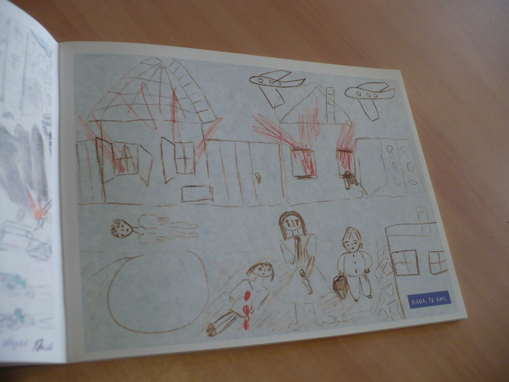

autoscale: true

# Reading and Doing Ethnography

### Social Anthropology 314

---

# 2.3 Observing representations workshop

---

# Observing is weird

---

## Partly you just vacuum up everything vaguely interesting.

---

## Partly you're already thinking a little bit about what to analyze.

---

---

---

---

---

---

---

# Fieldnotes from a French squat, April 10, 2010

you look out through the metro window and outside is some (there are screaming shouts in rhythm coming in through the window in our apartment) and outside is some hiss of speared light and reflected hair and skewed growls of platforms or of dim service rooms or of wisps of dusk and grease...

---

i just came home from visiting the squat by the fac. All cops are cunts, someone had spraypainted in english. We need free love, or some other such slogan, also in english. Plus a million other new graffitis and affiches. I started taking pictures of the signs, but my batteries ran low and I have to go back tomorrow...

---

The gate of the fac was closed when I arrived, near nine pm. You could see from across the courtyard that the lights were on and people were cooking, and when I got nearer, I discovered a chair placed next to an open window. A girl in a red sweater was cooking at the (vast industrial) stove just inside and I said: "How do you get in" ? and she said: "through there", or maybe: "through the window". and i climbed over and on the inside of the wide sill there was a little stepladder to climb down with. very romantic. (people were talking, later, about "pirates utopias".)

---

i didn't see a lot of people i knew. a—, who i talked to once. g—, who i only recognized after we'd talked, but again, i had only talked to him once. i asked him what was going on and he said: we're going to eat and then take the bus. which he did, later, leaving around when i did (except it was the metro).

---

... in the middle of talking, he went off elsewhere. that happened often as i was talking to people: them going off elsewhere. it seems that i am not an exciting conversationalist.

---

ah well, what can you do. i talked a bit to the cook, she offered me a beer, "or maybe you don't drink" — "yeah yeah i drink". — "you never know" (not exactly what she said, i think, but she said something to indicate that to her it seemed a reasonable question). i explained my story, it seemed like a good project to her i think, she was going to get a drink after cooking (an enormous dish of pasta)

---

she burned her hand a little stirring it, went to cool it down, i stirred it some and, in turn, i too got boiling water jumping up on my hand but it wasn't enough to really burn. after i drink a little she asks for some beer — we can share i say — you can go get another one she responds — where's it ? — in the freezer in siberia (and she points left) 

---

— and down the hall to the left i find siberia, a labeled walk-in freezer moderately well stocked with beer and limp, hippie-esque produce. the longer i stayed in that squat the more it reminded me of hippie co-ops in the US.

---

j— and a boy from the NPA (I think) with a shaved head talk about Sorel and French anarchists being at the origin of fascism. an israeli historian has claimed as much. there was a lot i didn't catch, a lot that was too quick and too soft, it was night, the beams of the building above towered over, an anomalous dog barked out in the night somewhere, it seemed, in the fac, the gardiens walked by as if on their rounds.

---

# Things to observe

- What things look like
- How it feels to be there
- What people say
- How you're treated
- What happens
- What material objects you see
- What's poignant

---

## Somehow from this mess you pull together a story

---

# Finished text (2014)

“How do you get in?” I asked. The gates of the university were shut and it was a Saturday night. The light fell down out of the windows of the cafe that had been taken over by student activists, shining over the dirty surface of the sidewalk and the white bricks of the walls, blurring and dimming as it ran out across the street to the bus depot and the end-of-the-line metro station with its dirty windowpanes, dwindling into the night and the empty lots and avenues running off into the long tangle of urban space, the kind of space that was endless and visually intricate in spite of its social status as a low, poor, dangerous neighborhood. 

---

It was a Saturday night and the streets were dead, and since the university’s gates were locked, there was no obvious way to get into the site of the occupation that I wanted to visit. But the lights were on and people were cooking, and when I got nearer, I discovered a chair set beside an open window. A young woman in a red sweater was cooking at the large industrial stove just inside, and when I asked how to get in, she gestured at the window and said “through here!” So I got up on the chair and climbed over and on the inside of the wide sill there was a little stepladder to climb down with. It seemed vaguely nautical, resonating with the “pirate utopias” I overheard someone talking about later. “They are sentries, let’s be pirates,” said the graffiti beside the window.

---

It appeared that the space had formerly been a medium-sized commercial cafe, with counters and an industrial kitchen, windows half-covered with metal shutters, long tables and chairs backed with metal bars. It was a space just beside the main entrance to the university, the old main entrance, just adjacent, having been “degraded” by student protests the year before, and then closed off to become an art gallery. The main entrance, which was also the only regular entrance to campus, had an obvious symbolic and practical appeal to student activists: given that almost everyone passed through it, it was extremely visible, not to mention convenient for the occasional blockade. 

---

On a superficial level, the entryway often elicited tensions between the activists and the campus security, who gradually clamped down on the thickets of posters and graffiti. But on a more structural level, one unacknowledged by local actors, the campus security policy was a major catalyst for campus activism, since it was the security policy that had opened only one entrance to campus, creating in the process an inadvertently centralized political space.

---

# Things you write about

- How things look and feel
- How spaces work
- How politics works

