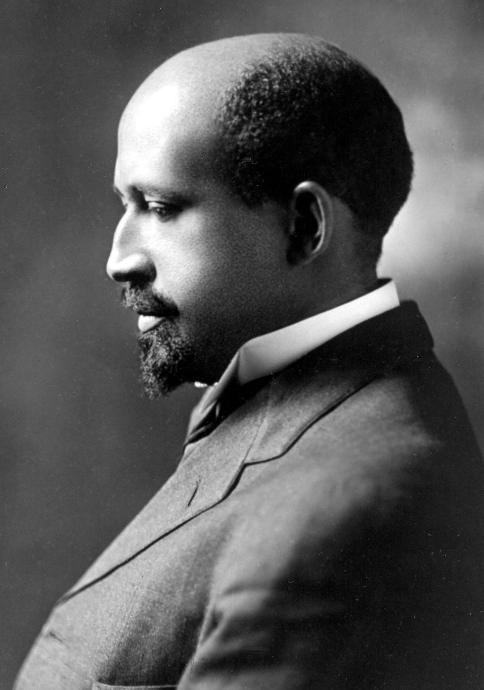
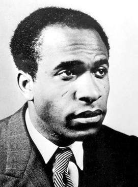

autoscale: true

# Reading and Doing Ethnography

### Social Anthropology 314

---

# 4.1 Double Consciousness

---

# W.E.B Du Bois (1868-1963)

---

## Du Bois biography

- Born in 1963 in the white Northeast, just after the U.S. Civil War.
- Undergraduate at Fisk University and postgraduate degrees at Harvard University (1891, 1895).
- Famous for sociological research on African Americans in Philadelphia.
- Co-founded National Association for the Advancement of Colored People (1909).
- Investigated by the U.S. government for subversive views...
- Dies in Ghana in 1963.

---

## Consciousness of difference

> The exchange was merry, till one girl, a tall newcomer, refused my card,––refused it peremptorily, with a glance. Then it dawned upon me with a certain suddenness that I was different from the others; or like, mayhap, in heart and life and longing, but shut out from their world by a vast veil. I had thereafter no desire to tear down that veil, to creep through; I held all beyond it in common contempt, and lived above it in a region of blue sky and great wandering shadows. (8)

---

## Being a problem

> They approach me in a half-hesitant sort of way, eye me curiously or compassionately, and then, instead of saying directly, How does it feel to be a problem? they say, I know an excellent colored man in my town; or, I fought at Mechanicsville; or, Do not these Southern outrages make your blood boil? At these I smile, or am interested, or reduce the boiling to a simmer, as the occasion may require. To the real question, How does it feel to be a problem? I answer seldom a word. (7)

---

## Double consciousness

> After the Egyptian and Indian, the Greek and Roman, the Teuton and Mongolian, the Negro is a sort of seventh son, born with a veil, and gifted with second-sight* in this American world,––a world which yields him no true self-consciousness, but only lets him see himself through the revelation of the other world. It is a peculiar sensation, this double-consciousness, this sense of always looking at one’s self through the eyes of others, of measuring one’s soul by the tape of a world that looks on in amused contempt and pity. One ever feels his two-ness,––an American, a Negro; two souls, two thoughts, two unreconciled strivings; two warring ideals in one dark body, whose dogged strength alone keeps it from being torn asunder. (8)

---

## Struggle to overcome doubleness

> The history of the American Negro is the history of this strife,–– this longing to attain self-conscious manhood, to merge his double self into a better and truer self. In this merging he wishes neither of the older selves to be lost. He would not Africanize America, for America has too much to teach the world and Africa. He would not bleach his Negro soul in a flood of white Americanism, for he knows that Negro blood has a message for the world. He simply wishes to make it possible for a man to be both a Negro and an American, without being cursed and spit upon by his fellows, without having the doors of Opportunity closed roughly in his face (9).

---

# Frantz Fanon (1925-1961)

---

## Fanon biography

- Psychiatrist from Martinique known for working in French-colonized Algeria.
- *Black Skin, White Masks* was meant to be a doctoral dissertation but was rejected.
- *The Wretched of the Earth* (1961) is a key text (and critical analysis) of anticolonial insurgency.
- He died very young of leukemia.

---

## Race as interpellation

> “Dirty nigger!” Or simply, “Look, a Negro!”
> I came into the world imbued with the will to find a meaning in things, my spirit filled with the desire to attain to the source of the world, and then I found that I was an object in the midst of other objects. (82)
--Markmann translation

---

## Relational identity

> Not only must the black man be black; he must be black in relation to the white man. Some critics will take it on themselves to remind us that this proposition has a converse. I say that this is false. The black man has no ontological resistance in the eyes of the white man. Overnight the Negro has been given two frames of reference within which he has had to place himself. His metaphysics, or, less pretentiously, his customs and the sources on which they were based, were wiped out because they were in conflict with a civilization that he did not know and that imposed itself on him. (82-83)

---

## Someone else's object

> It was no longer a question of being aware of my body in the third person but in a triple person. In the train I was given not one but two, three places. I had already stopped being amused. It was not that I was finding febrile coordinates in the world. I existed triply: I occupied space. I moved toward the other... and the evanescent other, hostile but not opaque, transparent, not there, disappeared. Nausea... (84)

---

## Reduced to the body

> My body was given back to me sprawled out, distorted, recolored, clad in mourning in that white winter day. The Negro is an animal, the Negro is bad, the Negro is mean, the Negro is ugly; look, a nigger, it’s cold, the nigger is shivering, the nigger is shivering because he is cold, the little boy is trembling because he is afraid of the nigger, the nigger is shivering with cold, that cold that goes through your bones, the handsome little boy is trembling because he thinks that the nigger is quivering with rage, the little white boy throws himself into his mother’s arms: Mama, the nigger’s going to eat me up. (86)

---

## Stages of dehumanization

> I made myself the poet of the world. The white man had found a poetry in which there was nothing poetic. The soul of the white man was corrupted, and, as I was told by a friend who was a teacher in the United States, “The presence of the Negroes beside the whites is in a way an insurance policy on humanness. When the whites feel that they have become too mechanized, they turn to the men of color and ask them for a little human sustenance.” At last I had been recognized, I was no longer a zero.
> I had soon to change my tune. Only momentarily at a loss, the white man explained to me that, genetically, I represented a stage of development. (98)

---

## Every hand was a losing hand

> Every hand was a losing hand for me. I analyzed my heredity. I made a complete audit of my ailment. I wanted to be typically Negro—it was no longer possible. I wanted to be white—that was a joke. And, when I tried, on the level of ideas and intellectual activity, to reclaim my negritude, it was snatched away from me. (101)

> It is not I who make a meaning for myself, but it is the meaning that was already there, pre-existing, waiting for me. (102)

> I am guilty. I do not know of what, but I know that I am no good. (106)

---

## And the implications for ethnographic fieldwork are...?

---

# Questions

---

## Du Bois questions

- Do African Americans in the 21st century still feel as if they have two separate identities?
- "Away with the black man’s ballot, by force or fraud,––and behold the suicide of a race!" - I found Du Bois' work interesting to read due to it not being a "typical" anthropological reading in a sense. The quote use of wording I found interesting due to such strong language used to stress his message.
- Why does Du Bois choose to include indirect rather direct observations, what effect does this create?
- Du Bois speaks of the struggle of merging two conciousses of oneself into two. Would representation in media be a factor of that?
- What does the author mean with "other world"? Is he addressing the fact that he himself is being othered by a racist society or is he himself othering the "other" race group? Who is the ethnographic subject in this piece? Is it the author himself?
- Would Du Bois' piece of writing be considered an ethnography? I merely ask this because of the narrative style in which it has been written.

---

## Fanon questions
- What exactly was Fanon observing?/ what was the point of the study?
- What affects the system of references? What is included or excluded in this system?
- Does the title "Black Skin, White Masks" refer to the fact that black people have to adopt the ways of white people through changing their behaviour, and code-switching, in order to compensate for their skin colour and increase their social standing in a pre-dominantly white society?

---

## General questions

- Will self consciousness eventually enable the black man to break free from the shackles of societies bias towards him as well as his own self doubt? Was this the main argument?
- Why is this aricle mostly focused on Negro men and their struggles while Negro women also had the same and many different struggles which also is a big deal to the Negro society?
- Is the 'other' white people and is the writer black and writing on his experiences or is the writer white writing on behalf of the black being; trying to decipher how it feels being him?
- What other solutions could have possibly been provided???
- As an outsider to South Africa, my views on race are different from that of locals. In what ways should I be aware of this in my own research? Is declaring my subjectivity part of this?
