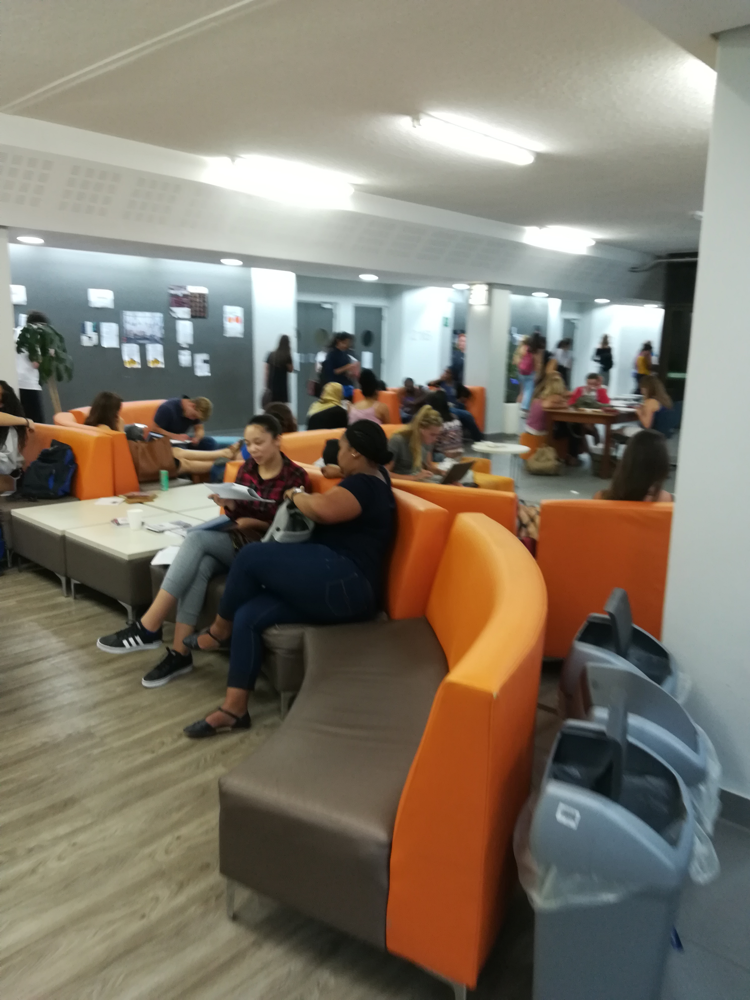
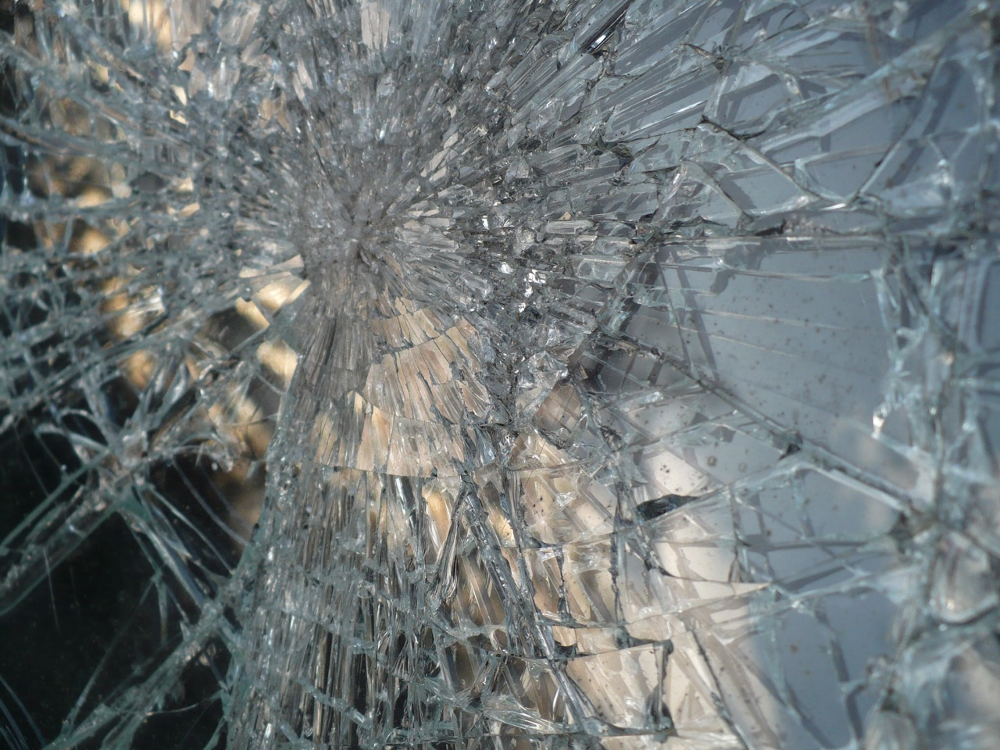

autoscale: true

# 7.2 Photography

### Reading and Doing Ethnography
### Social Anthropology 314

---

## Ruminations on photography

Taking photographs is a really different way of being in a world than taking notes or transcribing or just being there, somewhere, and writing about it later from memory. Taking good photos is a lot of work, usually involving taking a lot of photos and throwing away the bad ones, spending a lot of time peering through a viewfinder and looking for a good composition, trying to find or make social situations where photography is OK.

---

## Ruminations on photography

Taking photos involves all the aesthetic mediations of composition, light, and so on. Plus there are all kinds of epistemological questions about what, exactly, a photograph represents, indicates, fails to indicate, distorts, aestheticizes, dramatizes, makes emotionally present, etc...

Taking photos invokes a complicated set of relations between a knowing subject and a known object, between photographer and social milieu. 

---

## Ruminations on photography

Not to mention that there are a million questions about what to do with photos once they exist: they can become slides in powerpoint, background art, a way of familiarizing audiences with physically distant fieldsites, mere illustrations of some point or scene, objects of local sentiment or legal record, even objects of ethnographic analysis in their own right. 

---

## Deprofessionalization of photography

- Photography equipment began as high-end technology tended by experts.
- When photography used film, the unit costs of a single photograph were significant.
- Now cameras are as widespread as mobile devices and a single photo costs ~0.
- Photography is increasingly massified and deprofessionalized.

---

## Things to think about in photography

- Who is the object of the gaze?
- Who is the subject?
- What is their relationship (eg of power, culture, feeling)?
- What is the local significance of the scene?
- What is the local significance of the image itself?
- What are the risks of taking photos?

---

## Stellenbosch University Social Life

---

---

---

---

---

---

---

---

## Céret, France

---

---

---

---

---

---

---

---

---

---

---

---

---

---

---

---

---

---

---

---

---

---

---

## Seven years later in Saint-Denis, France

---

---

---

